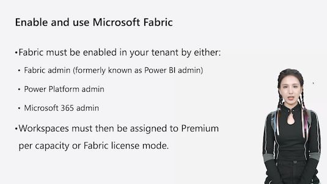
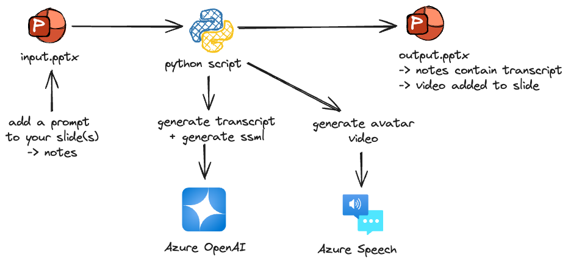

# PowerPoint video helper

This project aims to assist in adding videos of an avatar presenting and reasoning over a PowerPoint presentation, similar to how a human presenter would.

Consider the following screenshot as an example:



The code takes a PowerPoint file as input and outputs a new PowerPoint file with the video(s) added.

You can guide the avatar's speech by adding a prompt to the notes section of each slide. The avatar will interpret the prompt and discuss the slide content accordingly, rather than reading the notes verbatim.



To run the code, you need to have Python 3 installed. You can install the required packages by running `pip install -r requirements.txt`.

You will need to have a .env file with the following variables:

```txt
SPEECH_KEY=[yourkey]
SPEECH_ENDPOINT=https://[yourendpoint].api.cognitive.microsoft.com
AZURE_ENDPOINT=https://[yourendpoint].openai.azure.com/
AZURE_OPENAI_API_KEY=[yourkey]
```


## FAQ

### How do I add a video to a slide?

First, make sure you have entered a prompt in the notes section of the slide. Then, run the code, and the video will be added to the slide. The prompt can include content that you want the avatar to discuss.

### Can I customize the avatar?

Yes, by changing the talkingAvatarCharacter in the code, you can select a different avatar. You can also customize the voice used, search for synthesisConfig in the code.

### Can I change the background of the video to be transparent?

Unfortunately, the current version does not support this feature. The video will have a solid background. The code will try to match the background color of the video with the background color of the current slide.

Due to limitations in both the Speech API, as well as in PowerPoint, there is no easy way to get the video background completely transparent.

Check out:

- [python-pptx Slide Background](https://python-pptx.readthedocs.io/en/latest/dev/analysis/sld-background.html)
- [Batch synthesis backgroun properties](https://learn.microsoft.com/en-us/azure/ai-services/speech-service/text-to-speech-avatar/batch-synthesis-avatar-properties#:~:text=property%20is%20required.-,How%20to%20edit%20the%20background,-The%20avatar%20batch)
- [Video and audio file formats supported in PowerPoint](https://support.microsoft.com/en-us/office/video-and-audio-file-formats-supported-in-powerpoint-d8b12450-26db-4c7b-a5c1-593d3418fb59)